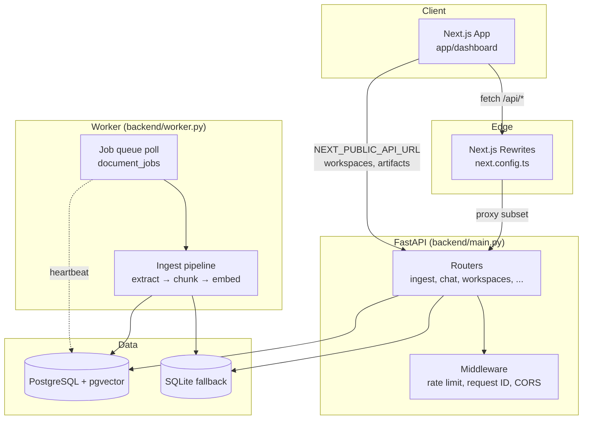
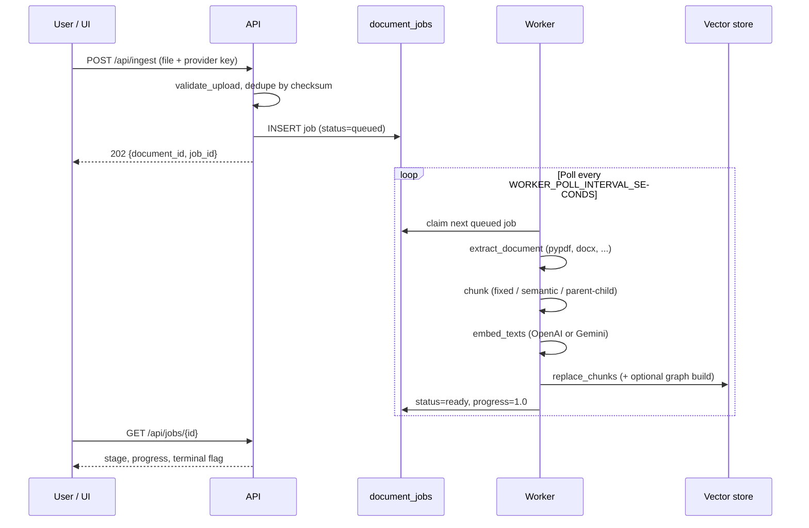
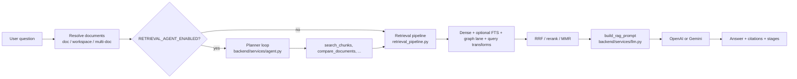
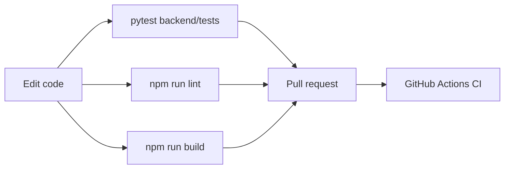
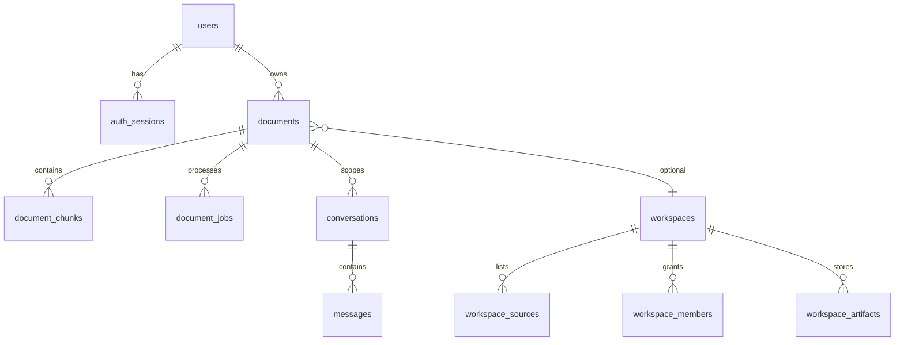
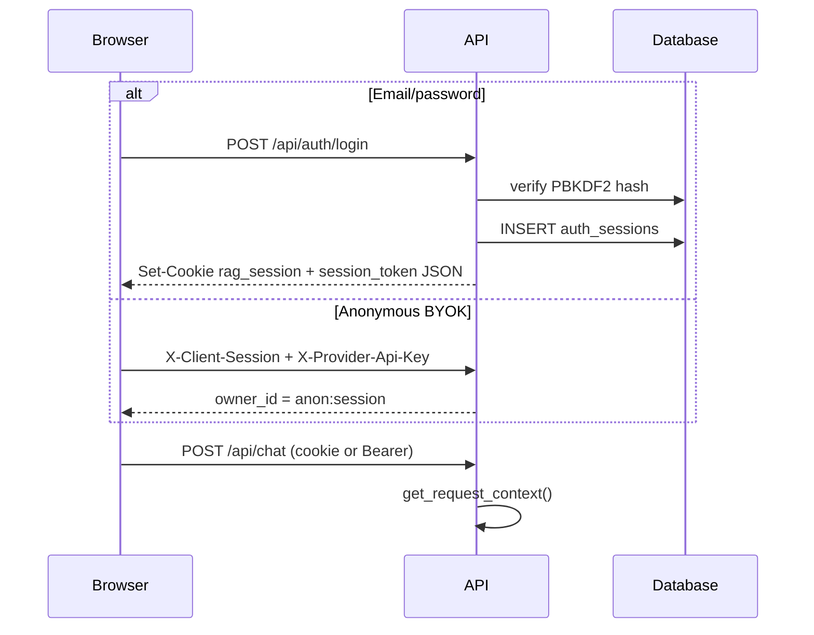

# Sourceful — Document Question-Answering Platform

[](LICENSE)
[](.github/workflows/ci.yml)
[](https://nodejs.org)
[](https://python.org)
[](https://nextjs.org)
[](https://fastapi.tiangolo.com)
[](https://github.com/pgvector/pgvector)

> **Self-hostable, production-oriented RAG** — upload documents, ask natural-language questions, and receive **streaming, cited answers** using your own OpenAI or Google Gemini API keys.

---

## Table of Contents

- [Overview](#overview)
- [Features](#features)
- [Screenshots & Demo](#screenshots--demo)
- [Tech Stack](#tech-stack)
- [Architecture Overview](#architecture-overview)
- [Folder Structure](#folder-structure)
- [Installation](#installation)
- [Environment Variables](#environment-variables)
- [Running Locally](#running-locally)
- [Development Workflow](#development-workflow)
- [API Documentation](#api-documentation)
- [Database Schema](#database-schema)
- [State Management & Data Flow](#state-management--data-flow)
- [Authentication & Authorization](#authentication--authorization)
- [AI / LLM Orchestration](#ai--llm-orchestration)
- [Integrations](#integrations--external-services)
- [Build & Deployment](#build--deployment)
- [Docker Setup](#docker-setup)
- [Testing](#testing)
- [Linting & Formatting](#linting--formatting)
- [Performance](#performance-optimizations)
- [Security](#security-considerations)
- [Scalability](#scalability-notes)
- [Known Issues & Limitations](#known-issues--limitations)
- [Roadmap Suggestions](#roadmap-suggestions)
- [Contributing](#contributing)
- [License](#license)
- [Credits](#credits--acknowledgements)

---

## Overview

### What problem it solves

Teams accumulate knowledge in PDFs, DOCX files, spreadsheets, and internal wikis, but generic chatbots cannot answer questions **grounded in those specific documents** without a retrieval pipeline. Sourceful closes that gap: it ingests files, embeds them into a vector index, retrieves relevant passages at query time, and generates answers that cite the exact chunks used.

### Why it exists

The repository evolved from a Streamlit prototype (`legacy/`) into a **split-stack product**: a Next.js 16 dashboard for upload/chat/notebook UX, and a FastAPI backend with a **durable background worker** for ingestion. The design optimizes for **self-hosting** (BYOK, no mandatory SaaS), **operational visibility** (jobs, metrics, readiness), and **incremental RAG sophistication** (hybrid search, reranking, GraphRAG, agentic retrieval) behind feature flags.

### Key differentiators

| Differentiator | How it shows up in code |
|----------------|-------------------------|
| **Bring Your Own Key (BYOK)** | Provider keys travel per-request via `X-Provider-Api-Key`; queued jobs temporarily store the key until the worker finishes (`document_jobs.provider_api_key`). |
| **Durable ingestion** | Upload returns `202` immediately; `backend/worker.py` polls `document_jobs` and runs extract → chunk → embed → index (`backend/services/jobs.py`). |
| **Dual storage path** | PostgreSQL + pgvector in production; SQLite + JSON embeddings locally when `DATABASE_URL` is unset (`backend/settings.py`). |
| **Progressive RAG** | Advanced lanes (hybrid FTS, reranker, MMR, query transforms, GraphRAG, agent loop) default **off** — baseline behavior stays stable. |
| **Workspaces & RBAC** | Multi-source knowledge bases with roles (`owner` / `admin` / `editor` / `viewer`) enforced in `backend/services/workspace_rbac.py`. |
| **Observable pipeline** | Each chat response can include a `stages` object; optional Langfuse tracing in `backend/services/tracing.py`. |

---

## Features

### Core (always available)

- **Document upload** — multipart `POST /api/ingest` with checksum deduplication per owner + provider + embedding model.
- **Job tracking** — stages: `queued` → `extracting` → `chunking` → `embedding` → `storing` → `ready` (or `error` with retries).
- **Grounded chat** — JSON (`POST /api/chat`) or SSE streaming (`POST /api/chat/stream`) with `Citation` objects (chunk id, score, page, excerpt).
- **Conversations** — persisted threads per document; export as Markdown/JSON.
- **Analysis modes** — `ask` (default), `compare`, `extract`, `brief` via `ChatRequest.mode` (`backend/models.py`).
- **Notebook UX** — split-pane PDF viewer at `/documents/{id}/notebook` with click-through citations (`app/components/NotebookPdf.tsx`).
- **User accounts** — email/password signup, session cookies + Bearer tokens, optional Google OAuth (`backend/routers/auth.py`).
- **Admin analytics** — platform overview and per-workspace activity (`backend/routers/analytics.py`).

### Advanced (feature-flagged)

- Hybrid dense + PostgreSQL full-text search (RRF fusion)
- Cross-encoder reranking (Cohere, Jina, local BGE, or noop)
- Semantic / parent-child chunking strategies
- Contextual retrieval enrichment (Anthropic-style situating sentences)
- Query transforms (HyDE, multi-query, step-back)
- MMR diversification, context compression, groundedness verifier
- GraphRAG entity extraction + community summaries + graph traversal lane
- Agentic planner–tool loop with `search_chunks`, `compare_documents`, etc.
- Rolling conversation memory (summary + recent verbatim turns)
- Message feedback (thumbs up/down) for active-learning signals

### In progress / schema-only

- **Cloud connectors** — Python classes exist (`backend/connectors/`) and DB tables (`connectors`, `connector_sync_runs`), but **no HTTP router** exposes connector CRUD yet.
- **Share links & usage quotas** — tables exist in migration v10+ (`share_links`, `usage_records`, `workspace_quotas`); public REST endpoints are not wired.

---

## Screenshots & Demo

<!-- Replace placeholders with real assets when publishing -->

| View | Path | Description |
|------|------|-------------|
| Marketing landing | `/` | Feature overview (`app/(marketing)/page.tsx`) |
| Dashboard | `/dashboard` | Upload, chat, workspaces, settings |
| Notebook | `/documents/{id}/notebook` | PDF + cited chat side-by-side |

```bash
# Quick demo flow (requires API + worker + frontend)
open http://localhost:3000/dashboard
# 1. Paste OpenAI or Gemini API key in Settings
# 2. Upload a PDF
# 3. Wait for job status → ready
# 4. Ask a question; open Notebook for citation jump-to-page
```

---

## Tech Stack

### Frontend

| Package | Version | Role |
|---------|---------|------|
| [Next.js](https://nextjs.org) | 16.2 | App Router, standalone Docker output, API rewrites |
| [React](https://react.dev) | 19.2 | UI runtime |
| [TypeScript](https://www.typescriptlang.org) | 5.x | Type-safe client |
| [Tailwind CSS](https://tailwindcss.com) | 4.x | Styling (`app/globals.css`) |
| [Framer Motion](https://www.framer.com/motion/) | 12.x | Motion / transitions |
| [react-pdf](https://github.com/wojtekmaj/react-pdf) | 10.x | Notebook PDF rendering |
| [react-markdown](https://github.com/remarkjs/react-markdown) | 10.x | Assistant message rendering |

### Backend

| Package | Role |
|---------|------|
| [FastAPI](https://fastapi.tiangolo.com) | HTTP API, validation, OpenAPI |
| [Uvicorn](https://www.uvicorn.org) | ASGI server |
| [Pydantic Settings](https://docs.pydantic.dev/latest/concepts/pydantic_settings/) | Typed configuration (`backend/settings.py`) |
| [OpenAI SDK](https://github.com/openai/openai-python) | Chat + embeddings |
| [google-generativeai](https://github.com/google/generative-ai-python) | Gemini chat + embeddings |
| [psycopg](https://www.psycopg.org) | Async PostgreSQL |
| [aiosqlite](https://github.com/omnilib/aiosqlite) | Local SQLite fallback |
| [pypdf](https://github.com/py-pdf/pypdf) / [python-docx](https://python-docx.readthedocs.io) | Document text extraction |
| [sse-starlette](https://github.com/sysid/sse-starlette) | Chat streaming |
| [orjson](https://github.com/ijl/orjson) | Fast JSON for citations + SSE |

### Infrastructure

| Component | Notes |
|-----------|-------|
| PostgreSQL 17 + [pgvector](https://github.com/pgvector/pgvector) | Production vectors + optional FTS (`content_tsv`) |
| Docker Compose | `web`, `api`, `worker`, `postgres` |
| GitHub Actions | Lint, build, pytest, eval workflows |
| Langfuse (optional) | Retrieval/chat trace export |

---

## Architecture Overview

Sourceful is a **four-process** system in production: browser → Next.js → FastAPI API → background worker → database.



### Ingestion execution flow



### Chat / RAG execution flow



**Why a separate worker?** Ingestion is CPU- and IO-heavy (parsing, embedding batches). Keeping it off the API process prevents upload/chat latency spikes and lets you scale workers independently. `/ready` explicitly checks for a **fresh worker heartbeat** in `service_heartbeats` — API-only deployments are considered not production-ready.

---

## Folder Structure

```
sourceful/
├── app/                          # Next.js App Router (frontend)
│   ├── (marketing)/              # Public landing page
│   ├── dashboard/                # Main authenticated app shell
│   ├── documents/[id]/notebook/  # Split-pane PDF + chat
│   ├── components/               # UI: ChatArea, Sidebar, workspaces, etc.
│   └── lib/
│       ├── api.ts                # Typed HTTP client + SSE chat stream
│       ├── store.tsx             # React context + localStorage/session state
│       └── server-state.tsx      # Server-driven refresh helpers
├── backend/
│   ├── main.py                   # FastAPI app, middleware, router mounts
│   ├── worker.py                 # Background job consumer entrypoint
│   ├── settings.py               # All environment-backed configuration
│   ├── models.py                 # Pydantic request/response contracts
│   ├── migrations.py             # Schema v1–v15 (SQLite + Postgres DDL)
│   ├── auth.py                   # Password hashing, sessions, superuser bootstrap
│   ├── middleware.py             # Rate limit, request ID, security headers
│   ├── database.py               # Connection pool, query helpers
│   ├── routers/                  # HTTP route modules (thin controllers)
│   ├── services/                 # Business logic: jobs, retrieval, LLM, graph, ...
│   ├── connectors/               # Google Drive, Notion, Confluence, S3 (library)
│   └── tests/                    # pytest suite + golden retrieval evals
├── docs/
│   ├── production.md             # Ops checklist
│   └── eval/                     # Retrieval benchmark baselines + last runs
├── legacy/                       # Original Streamlit prototype (frozen)
├── docker-compose.yml            # Full stack: postgres, api, worker, web
├── Dockerfile                    # Next.js standalone production image
├── backend/Dockerfile            # Python API/worker image
├── .env.example                  # Documented configuration template
└── AGENTS.md                     # Contributor/agent orientation (not user docs)
```

### Important modules

| File | Responsibility |
|------|----------------|
| `backend/services/jobs.py` | Enqueue, claim, process ingest jobs; retry with backoff |
| `backend/services/retrieval_pipeline.py` | Dense/hybrid/rerank/MMR orchestration |
| `backend/services/agent.py` | Provider-agnostic JSON planner loop |
| `backend/services/agent_tools.py` | Audited tool registry (`search_chunks`, etc.) |
| `backend/services/vectorstore.py` | pgvector / SQLite similarity queries |
| `backend/routers/chat.py` | Chat, stream, rerun; wires retrieval + memory + grounding |
| `app/lib/api.ts` | Frontend API surface (1300+ lines, mirrors backend contracts) |
| `next.config.ts` | Rewrites `/api/*` subset to `BACKEND_URL` |

---

## Installation

### Prerequisites

| Requirement | Version | Notes |
|-------------|---------|-------|
| Node.js | ≥ 20 (22 in CI) | `npm ci` |
| Python | 3.12 recommended | venv for backend |
| OpenAI **or** Gemini API key | — | BYOK per request |
| Docker Compose | optional | Full stack with Postgres |
| PostgreSQL + pgvector | pg 15+ | Production; omit for SQLite dev |

### 1. Clone and configure

```bash
git clone https://github.com/himanshu-nakrani/sourceful.git
cd sourceful
cp .env.example .env
# Edit .env — at minimum set DEFAULT_SUPERUSER_PASSWORD
```

### 2. Frontend dependencies

```bash
npm ci
```

### 3. Backend virtual environment

```bash
python3 -m venv .venv
.venv/bin/pip install -r backend/requirements.txt
# For tests / CI parity:
.venv/bin/pip install -r backend/requirements-dev.txt
```

---

## Environment Variables

Full template: [`.env.example`](./.env.example). Below is a reference grouped by concern.

### Required

| Variable | Description |
|----------|-------------|
| `DEFAULT_SUPERUSER_PASSWORD` | **Required.** Bootstraps/resets the admin user (`DEFAULT_SUPERUSER_EMAIL`) on API startup (`backend/auth.py`). |

### Storage

| Variable | Default | Description |
|----------|---------|-------------|
| `DATABASE_URL` | _(unset)_ | PostgreSQL DSN. When set, enables pgvector + hybrid FTS. |
| `DATABASE_PATH` | `data/ragapp.db` | SQLite file when `DATABASE_URL` is unset. |
| `VECTOR_STORE_DIRECTORY` | `data/vectors` | Legacy/local vector path (SQLite era). |
| `DOCUMENT_REGISTRY_PATH` | `data/documents.json` | Legacy document registry path. |

### Frontend ↔ backend wiring

| Variable | Default | Description |
|----------|---------|-------------|
| `NEXT_PUBLIC_API_URL` | _(empty)_ | **Set to `http://127.0.0.1:8000` for local dev.** When empty, `app/lib/api.ts` uses same-origin paths; Next.js rewrites only proxy a **subset** of routes (see [Known Issues](#known-issues--limitations)). |
| `BACKEND_URL` | `http://127.0.0.1:8000` | Used by `next.config.ts` rewrites at build time. |
| `CORS_ORIGINS` | localhost ports | Comma-separated origins for FastAPI CORS. |

### Ingestion & retrieval tuning

| Variable | Default | Description |
|----------|---------|-------------|
| `MAX_DOCUMENT_BYTES` | `10485760` | Upload size cap (10 MiB). |
| `CHUNK_SIZE` / `CHUNK_OVERLAP` | `1200` / `200` | Fixed chunking window. |
| `CHUNK_STRATEGY` | `fixed` | `fixed` \| `semantic` |
| `RAG_TOP_K` | `5` | Default retrieval count. |
| `WORKER_POLL_INTERVAL_SECONDS` | `1.5` | Worker queue poll interval. |
| `WORKER_HEARTBEAT_TTL_SECONDS` | `60` | Stale worker threshold for `/ready`. |

### Auth

| Variable | Default | Description |
|----------|---------|-------------|
| `DEFAULT_SUPERUSER_EMAIL` | `admin@example.com` | Admin bootstrap email. |
| `AUTH_COOKIE_NAME` | `rag_session` | HttpOnly session cookie. |
| `AUTH_COOKIE_TTL_HOURS` | `168` | Session lifetime (7 days). |
| `AUTH_SECURE_COOKIES` | `false` | Set `true` behind HTTPS in production. |
| `GOOGLE_OAUTH_CLIENT_ID` / `SECRET` | empty | Optional Google sign-in. |

### Feature flags (retrieval / agent / graph)

See [`.env.example`](./.env.example) for the complete list. All `RETRIEVAL_*` flags default to **`false`** so production behavior matches the baseline dense pipeline unless you opt in.

---

## Running Locally

You need **three processes** for the full experience (upload progress, chat over indexed docs):

### Terminal 1 — API

```bash
export DEFAULT_SUPERUSER_PASSWORD=dev-admin-secret
.venv/bin/uvicorn backend.main:app --reload --host 127.0.0.1 --port 8000
```

### Terminal 2 — Worker

```bash
export DEFAULT_SUPERUSER_PASSWORD=dev-admin-secret
.venv/bin/python -m backend.worker
```

### Terminal 3 — Frontend

```bash
export NEXT_PUBLIC_API_URL=http://127.0.0.1:8000
export BACKEND_URL=http://127.0.0.1:8000
npm run dev
```

Open **[http://localhost:3000/dashboard](http://localhost:3000/dashboard)**.

| URL | Purpose |
|-----|---------|
| `http://localhost:3000` | Marketing site |
| `http://localhost:3000/dashboard` | Main app |
| `http://127.0.0.1:8000/docs` | FastAPI Swagger UI |
| `http://127.0.0.1:8000/health` | Liveness |
| `http://127.0.0.1:8000/ready` | Readiness (schema + worker heartbeat) |

---

## Development Workflow



| Task | Command |
|------|---------|
| Frontend dev server | `npm run dev` |
| Production build | `npm run build` |
| Lint | `npm run lint` |
| Full frontend check | `npm run check` (lint + build) |
| Backend unit tests | `npm run test:backend` or `pytest -q backend/tests` |
| Targeted test file | `pytest -q backend/tests/test_workspaces.py` |
| Retrieval eval (golden set) | `pytest -m eval backend/tests/eval` |
| Compose validation | `docker compose config` |
| Docstring gate (RAG modules) | `bash scripts/check_docstrings_rag_modules.sh` |

**Agent / contributor notes:** See [`AGENTS.md`](./AGENTS.md) for code-map conventions. Do not assume ingestion works with API-only — always run the worker when testing uploads.

---

## API Documentation

Base URL: `http://127.0.0.1:8000` (or proxied via Next.js for rewritten routes).

### Common headers

| Header | Required | Purpose |
|--------|----------|---------|
| `X-Provider-Api-Key` | Ingest, reprocess, chat | BYOK for OpenAI/Gemini |
| `X-Client-Session` | Anonymous mode | Stable id → `owner_id = anon:{session}` |
| `Authorization: Bearer <token>` | Authenticated mode | Session from login/signup |
| `Cookie: rag_session=...` | Browser auth | HttpOnly alternative to Bearer |
| `X-Request-ID` | Optional | Correlation id (auto-generated if omitted) |

### Error envelope

```json
{
  "error": "Human-readable message",
  "code": "MACHINE_CODE",
  "request_id": "uuid",
  "details": {}
}
```

### Endpoint reference

#### System

| Method | Path | Auth | Description |
|--------|------|------|-------------|
| `GET` | `/health` | None | Process liveness |
| `GET` | `/ready` | None | Schema + worker heartbeat |
| `GET` | `/metrics` | None | Prometheus text exposition |

#### Auth (`backend/routers/auth.py`)

| Method | Path | Description |
|--------|------|-------------|
| `POST` | `/api/auth/signup` | Create user + session |
| `POST` | `/api/auth/login` | Email/password login |
| `POST` | `/api/auth/logout` | Revoke session |
| `GET` | `/api/auth/me` | Current user (authenticated) |
| `POST` | `/api/auth/change-password` | Change password |
| `GET` | `/api/auth/google/config` | OAuth client id |
| `POST` | `/api/auth/google/callback` | Exchange Google code for session |

#### Ingestion & documents

| Method | Path | Description |
|--------|------|-------------|
| `POST` | `/api/ingest` | Upload file → `202` + job |
| `GET` | `/api/jobs/{job_id}` | Job progress |
| `GET` | `/api/documents` | List documents (owner-scoped) |
| `GET` | `/api/documents/{id}` | Document metadata |
| `GET` | `/api/documents/{id}/status` | Lightweight status |
| `GET` | `/api/documents/{id}/chunks` | Chunk preview |
| `GET` | `/api/documents/{id}/content` | Raw extracted text |
| `POST` | `/api/documents/{id}/reprocess` | Re-embed / retry |
| `POST` | `/api/documents/{id}/extract` | Structured field extraction |
| `DELETE` | `/api/documents/{id}` | Delete document + chunks |

#### Chat

| Method | Path | Description |
|--------|------|-------------|
| `POST` | `/api/chat` | Synchronous grounded answer |
| `POST` | `/api/chat/stream` | SSE streaming answer |
| `POST` | `/api/chat/rerun` | Regenerate a prior assistant message |

#### Conversations

| Method | Path | Description |
|--------|------|-------------|
| `GET` | `/api/conversations` | List threads |
| `GET` | `/api/conversations/{id}` | Thread + messages |
| `PATCH` | `/api/conversations/{id}` | Rename |
| `GET` | `/api/conversations/{id}/export` | Markdown or JSON export |
| `DELETE` | `/api/conversations/{id}` | Delete thread |

#### Workspaces & sources (`backend/routers/workspaces.py`)

| Method | Path | Description |
|--------|------|-------------|
| `GET` | `/api/workspaces` | List (auto-creates default workspace) |
| `POST` | `/api/workspaces` | Create workspace |
| `GET` | `/api/workspaces/{id}` | Get workspace |
| `PATCH` | `/api/workspaces/{id}` | Update / archive |
| `GET` | `/api/workspaces/{id}/my-role` | Caller RBAC role |
| `GET` | `/api/workspaces/{id}/sources` | List sources |
| `POST` | `/api/workspaces/{id}/sources/url` | Ingest URL source |
| `POST` | `/api/workspaces/{id}/sources/{source_id}/reprocess` | Refresh source |
| `GET` | `/api/workspaces/{id}/sources/{source_id}/sync-runs` | URL sync history |
| `GET/POST/PATCH/DELETE` | `/api/workspaces/{id}/members` | Member CRUD |
| `GET/POST/DELETE` | `/api/workspaces/{id}/invitations` | Invitations |

#### Artifacts (`backend/routers/artifacts.py`)

| Method | Path | Description |
|--------|------|-------------|
| `GET` | `/api/workspaces/{id}/artifacts` | List notes / saved answers |
| `POST` | `/api/workspaces/{id}/artifacts` | Create artifact |
| `POST` | `/api/workspaces/{id}/artifacts/from-message` | Save assistant reply |
| `GET/PATCH/DELETE` | `/api/workspaces/{id}/artifacts/{artifact_id}` | CRUD |

#### Admin & feedback

| Method | Path | Description |
|--------|------|-------------|
| `GET` | `/api/users` | List users (admin) |
| `PATCH` | `/api/users/{id}` | Update role / active flag |
| `GET` | `/api/analytics/overview` | Platform metrics |
| `GET` | `/api/workspaces/{id}/analytics` | Workspace metrics |
| `GET` | `/api/workspaces/{id}/activity` | Recent activity feed |
| `GET` | `/api/models?provider=openai` | List chat + embedding models |
| `POST` | `/api/feedback` | Thumbs up/down on message |
| `GET` | `/api/feedback/summary` | Aggregate feedback |

### Request / response examples

#### Ingest

```bash
curl -X POST http://127.0.0.1:8000/api/ingest \
  -H "X-Client-Session: demo-session-001" \
  -H "X-Provider-Api-Key: $OPENAI_API_KEY" \
  -F "provider=openai" \
  -F "embedding_model=text-embedding-3-small" \
  -F "file=@./report.pdf"
```

```json
{
  "document_id": "8b2f4e1a-...",
  "job_id": "c91d0a3b-...",
  "status": "queued",
  "embedding_model": "text-embedding-3-small",
  "deduplicated": false
}
```

#### Chat (workspace-scoped)

```bash
curl -X POST http://127.0.0.1:8000/api/chat \
  -H "Content-Type: application/json" \
  -H "X-Client-Session: demo-session-001" \
  -H "X-Provider-Api-Key: $OPENAI_API_KEY" \
  -d '{
    "provider": "openai",
    "model": "gpt-4o-mini",
    "workspace_id": "ws-uuid",
    "question": "What are the main risks mentioned?",
    "mode": "ask"
  }'
```

```json
{
  "conversation_id": "...",
  "message_id": "...",
  "content": "The document highlights ...",
  "sources": [
    {
      "chunk_id": "...",
      "document_id": "...",
      "excerpt": "...",
      "score": 0.82,
      "page_number": 4
    }
  ]
}
```

#### Chat stream (SSE)

Events emitted in order: `sources` → `token` (many) → `message_saved` → `done`. On failure: single `event: error`.

```bash
curl -N -X POST http://127.0.0.1:8000/api/chat/stream \
  -H "Content-Type: application/json" \
  -H "X-Client-Session: demo-session-001" \
  -H "X-Provider-Api-Key: $OPENAI_API_KEY" \
  -d '{"provider":"openai","model":"gpt-4o-mini","document_id":"...","question":"Summarize section 2"}'
```

---

## Database Schema

Schema version **15** (`backend/migrations.py`). Applied automatically on API/worker startup via `require_current_schema()`.

### Core entities



| Table | Purpose |
|-------|---------|
| `documents` | File metadata, status, checksum dedupe, optional `workspace_id` |
| `document_jobs` | Durable queue; stores `provider_api_key` until job completes |
| `document_chunks` | Text + embeddings (pgvector column or `embedding_json` in SQLite) |
| `conversations` / `messages` | Chat history; `sources_json` on assistant messages |
| `users` / `auth_sessions` | Credentials + session tokens (hashed) |
| `workspaces` / `workspace_members` | Multi-tenant knowledge bases + RBAC |
| `workspace_sources` | Unified file / URL / note sources per workspace |
| `workspace_artifacts` | Saved notes, briefs, extraction results |
| `feedback` | Per-message ratings (Phase 3.8) |
| `conversation_memory` | Rolling summaries (Phase 3.7) |
| `graph_entities` / `graph_relations` / `graph_communities` | GraphRAG (optional ingest) |
| `connectors` / `connector_sync_runs` | Future external sync (schema present) |
| `share_links` / `usage_records` / `workspace_quotas` | Future sharing & metering |

---

## State Management & Data Flow

### Frontend (`app/lib/store.tsx`)

- **React Context + useReducer** — no Redux; single `StoreProvider` wraps the dashboard.
- **Persistence split:**
  - `localStorage` (`rag-prefs`) — theme, provider choice, top-k (non-secret).
  - `sessionStorage` (`rag-session`) — `providerApiKey`, `clientSessionId`, `authToken`.
- **Workspace state** — `workspaces`, `activeWorkspaceId` loaded via `listWorkspaces()` on auth.
- **Server state** — `ServerStateProvider` coordinates polling for documents/jobs.

### Scoping model

```
owner_id = "user:{uuid}"     # authenticated
owner_id = "anon:{session}"  # anonymous + X-Client-Session
```

All documents, jobs, conversations, and chunks are filtered by `owner_id`. Workspace membership adds a second authorization layer via RBAC.

### Next.js API routing

`next.config.ts` rewrites a **subset** of `/api/*` to `BACKEND_URL`. Workspace and artifact routes are **not** in the rewrite table — the frontend calls them via `NEXT_PUBLIC_API_URL` when set (`app/lib/api.ts` `url()` helper).

---

## Authentication & Authorization

### Authentication flow



### Authorization layers

1. **Request context** (`backend/routers/deps.py`) — resolves `owner_id` from session or client session header.
2. **Provider key** — `require_provider_api_key` on LLM-touching routes.
3. **Workspace RBAC** (`backend/services/workspace_rbac.py`) — role hierarchy: `viewer` < `editor` < `admin` < `owner`.
4. **Platform admin** — `role == "admin"` for `/api/users` and analytics.

On startup, `ensure_default_superuser()` resets the admin password hash from `DEFAULT_SUPERUSER_PASSWORD` — intentional for appliances, but **rotate immediately** in production.

---

## AI / LLM Orchestration

### Model providers

| Provider | Ingest / embed | Chat | Notes |
|----------|----------------|------|-------|
| `openai` | ✅ | ✅ | Default models in `settings.py` |
| `gemini` | ✅ | ✅ | Google Generative AI SDK |
| `vertex_search` | ✅ (ingest) | — | Uses Google Cloud Discovery Engine; service credentials |

### Retrieval pipeline (`backend/services/retrieval_pipeline.py`)

Stateless orchestrator:

1. Embed query (`embed_query`)
2. Dense vector search (`query_similar` / `query_similar_multi`)
3. Optional FTS lane + RRF (`hybrid.py`) — Postgres only
4. Optional rerank (`reranker.py`)
5. Optional MMR diversification (`mmr.py`)
6. Return `RetrievalResult` with `stages` metadata

### Agentic mode (`RETRIEVAL_AGENT_ENABLED=true`)

The planner in `backend/services/agent.py` uses **JSON envelopes** (not native tool-calling APIs) for provider portability:

```json
{"action": "call_tool", "tool": "search_chunks", "args": {"query": "..."}, "thought": "..."}
{"action": "answer", "thought": "..."}
{"action": "abstain", "reason": "..."}
```

Tools (`backend/services/agent_tools.py`): `search_chunks`, `get_document_summary`, `list_documents`, `compare_documents`.

Hard caps: `RETRIEVAL_AGENT_MAX_ITERATIONS`, `RETRIEVAL_AGENT_MAX_CHUNKS`, `RETRIEVAL_AGENT_MAX_TOOL_CALLS`.

### Memory (`MEMORY_ENABLED=true`)

`backend/services/memory.py` maintains:

- Verbatim **recent** turns (`MEMORY_RECENT_TURNS`)
- LLM-updated **summary** of older turns in `conversation_memory`

Fails open — summarization errors fall back to last-N history.

### Prompting

`build_rag_prompt` in `backend/services/llm.py` injects retrieved chunks with citation instructions. Analysis modes (`compare`, `extract`, `brief`) swap system instructions without changing the citation contract.

### Tracing

When `LANGFUSE_PUBLIC_KEY` and `LANGFUSE_SECRET_KEY` are set, spans wrap retrieval, agent iterations, and chat generation (`backend/services/tracing.py`). Otherwise zero overhead no-op.

---

## Integrations & External Services

| Integration | Status | Location |
|-------------|--------|----------|
| OpenAI API | Production | `backend/services/llm.py`, `embeddings.py` |
| Google Gemini | Production | same |
| Vertex AI Search | Partial | `backend/services/vertex_search.py`; ingest path in routers |
| Google OAuth | Optional | `backend/routers/auth.py` |
| Langfuse | Optional | `backend/services/tracing.py` |
| Google Drive / Notion / Confluence / S3 | Library only | `backend/connectors/` — no REST management API yet |
| Cohere / Jina rerankers | Optional | `backend/services/reranker.py` when `RETRIEVAL_RERANKER_ENABLED=true` |

---

## Build & Deployment

### npm scripts

| Script | Description |
|--------|-------------|
| `npm run dev` | Next.js development server (port 3000) |
| `npm run build` | Production build (standalone output) |
| `npm run start` | Run production server |
| `npm run lint` | ESLint |
| `npm run check` | `lint` + `build` |
| `npm run test:backend` | `pytest -q backend/tests` |

### Production topology

Recommended ([`docs/production.md`](./docs/production.md)):

| Service | Exposure | Notes |
|---------|----------|-------|
| `web` | Public (reverse proxy) | Next.js standalone |
| `api` | Internal or proxied | FastAPI |
| `worker` | None | Always-on; ≥1 replica |
| `postgres` | Private | Persistent volume |

### Heroku-style Procfile

```
web: uvicorn backend.main:app --host 0.0.0.0 --port $PORT
worker: python -m backend.worker
```

### Reverse proxy

Proxy browser traffic to `web`. Either:

- Expose API paths on the same host (extend `next.config.ts` rewrites), or
- Set `NEXT_PUBLIC_API_URL` to the public API origin and configure `CORS_ORIGINS`.

Also proxy `/health`, `/ready`, `/metrics` for monitoring.

---

## Docker Setup

```bash
docker compose up --build
```

| Service | Port | Image |
|---------|------|-------|
| `postgres` | 5432 | `pgvector/pgvector:pg17` |
| `api` | 8000 | `backend/Dockerfile` |
| `worker` | — | same image, `python -m backend.worker` |
| `web` | 3000 | root `Dockerfile` (Next standalone) |

Compose sets `DATABASE_URL` for all Python services. For workspace features from the browser, add to `web` environment:

```yaml
NEXT_PUBLIC_API_URL: http://localhost:8000
```

(Or extend Next.js rewrites — see limitations below.)

### Backup

```bash
docker compose exec postgres pg_dump -U document_rag document_rag > backup.sql
cat backup.sql | docker compose exec -T postgres psql -U document_rag -d document_rag
```

---

## Testing

| Suite | Command | Purpose |
|-------|---------|---------|
| Unit + integration | `pytest -q backend/tests` | Routers, RBAC, jobs, retrieval |
| Eval / golden | `pytest -m eval backend/tests/eval` | Retrieval quality regression |
| Frontend | `npm run lint && npm run build` | Types + ESLint |
| Compose | `docker compose config` | Validate orchestration |
| Nightly eval | [`.github/workflows/nightly-eval.yml`](./.github/workflows/nightly-eval.yml) | Scheduled retrieval benchmarks |

CI runs on push/PR to `main` ([`.github/workflows/ci.yml`](./.github/workflows/ci.yml)).

---

## Linting & Formatting

- **Frontend:** ESLint 9 + `eslint-config-next` — `npm run lint`
- **Backend:** no enforced formatter in CI; follow existing module style
- **Docstrings:** `scripts/check_docstrings_rag_modules.sh` enforces coverage on RAG pipeline modules

---

## Performance Optimizations

- **orjson** for citation parsing and SSE payloads in hot paths (`backend/routers/chat.py`)
- **Pre-compiled Pydantic TypeAdapter** for `list[Citation]` deserialization
- **HNSW pgvector index** (tunable via `PGVECTOR_HNSW_*`) with IVFFlat fallback on older pgvector
- **Checksum deduplication** skips re-embedding identical files per owner
- **Over-fetch + rerank** only when `RETRIEVAL_RERANKER_ENABLED=true`
- **Standalone Next.js output** — minimal production Node image (`Dockerfile`)
- **IP-based rate limiting** in middleware (not per random auth header) to prevent bypass

---

## Security Considerations

- **BYOK** — provider keys are not stored long-term on users; job queue temporarily holds keys for worker processing.
- **Password storage** — PBKDF2-SHA256 with 480k iterations (`backend/auth.py`).
- **Session tokens** — stored hashed in `auth_sessions`; HttpOnly cookies in browser mode.
- **Owner scoping** — every query includes `owner_id`; agent tools cannot escape document allow-lists.
- **Rate limiting** — per-IP RPM (`RATE_LIMIT_RPM`) persisted in `rate_limit_windows`.
- **Security headers** — `SecurityHeadersMiddleware` on all API responses.
- **Upload validation** — extension allow-list + size cap (`validate_upload` in `backend/services/extract.py`).
- **Production checklist:** set `AUTH_SECURE_COOKIES=true`, strong `DEFAULT_SUPERUSER_PASSWORD`, restrict `CORS_ORIGINS`, run Postgres on a private network, terminate TLS at the proxy.

---

## Scalability Notes

- **Horizontal scaling:** run multiple `worker` replicas; job claiming uses atomic `UPDATE ... WHERE status='queued'` to avoid double processing.
- **API replicas:** stateless except DB connection pool; ensure shared Postgres.
- **Readiness gate:** load balancers should use `/ready`, not `/health`, so traffic only hits clusters with a live worker.
- **Vector index:** tune HNSW parameters for recall/latency tradeoffs on large corpora.
- **Feature flags:** enable hybrid/agent/graph incrementally per environment without code changes.

---

## Known Issues & Limitations

| Limitation | Detail |
|------------|--------|
| **Worker required** | Upload/chat over indexed docs fails without `backend.worker` running. |
| **Next.js rewrite gap** | `next.config.ts` does not proxy `/api/workspaces/*` or `/api/workspaces/*/artifacts/*`. Set `NEXT_PUBLIC_API_URL` or add rewrites. |
| **SQLite dev fallback** | No hybrid FTS, reduced vector performance; not recommended for production. |
| **Connectors** | Python + DB schema exist; no public connector REST API yet. |
| **Usage / share APIs** | Tables migrated; HTTP endpoints not implemented. |
| **Vertex Search** | Partially integrated; main path uses OpenAI/Gemini embeddings. |
| **Provider keys in job rows** | Queued jobs store `provider_api_key` until completion — treat DB as sensitive. |
| **Superuser password reset** | Every API start resets admin password from env — surprising if unintended. |

---

## Roadmap Suggestions

- Add Next.js rewrites for workspaces, artifacts, and feedback (parity with `app/lib/api.ts`)
- Expose connector CRUD + scheduled sync HTTP API atop `backend/connectors/`
- Wire `share_links` and `usage_records` to UI + enforcement middleware
- Optional OIDC / SSO beyond Google OAuth
- Document-level access ACLs within shared workspaces
- OCR / layout-aware extraction (marketing page references Docling — evaluate integration)
- Helm chart or Terraform module for cloud deployment

---

## Contributing

Contributions are welcome — bug reports, fixes, features, and docs improvements. See [CONTRIBUTING.md](CONTRIBUTING.md) for the full workflow and [CODE_OF_CONDUCT.md](CODE_OF_CONDUCT.md) for community expectations. Project governance, maintainer list, and release process are documented in [GOVERNANCE.md](GOVERNANCE.md), [MAINTAINERS.md](MAINTAINERS.md), and [RELEASING.md](RELEASING.md). To report a security issue privately, see [SECURITY.md](SECURITY.md).

Quick checklist:

1. Fork and create a feature branch.
2. Run targeted tests first, then `pytest -q backend/tests` for cross-cutting changes.
3. For UI changes: `npm run lint` and manual browser verification.
4. For retrieval changes: run eval suite and compare `docs/eval/last_run.json` to baseline.
5. Keep `legacy/` untouched unless the task explicitly targets it.
6. Open a PR with a clear test plan.

---

## License

[Apache License 2.0](LICENSE)

---

## Credits & Acknowledgements

- Built with [FastAPI](https://fastapi.tiangolo.com), [Next.js](https://nextjs.org), and [pgvector](https://github.com/pgvector/pgvector).
- RAG techniques inspired by industry patterns (hybrid search, contextual retrieval, GraphRAG, agentic RAG) implemented as optional, flag-gated modules.
- Original Streamlit prototype preserved under `legacy/` for reference.

---

<p align="center">
  <strong>Questions or production help?</strong> See <a href="./docs/production.md">docs/production.md</a> and <a href="./AGENTS.md">AGENTS.md</a> for operator and contributor guides.
</p>
